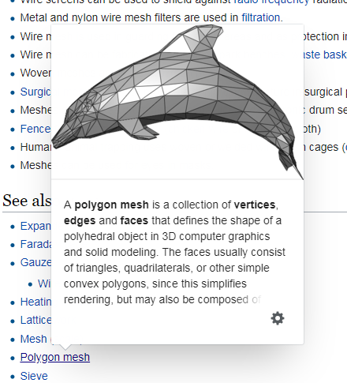
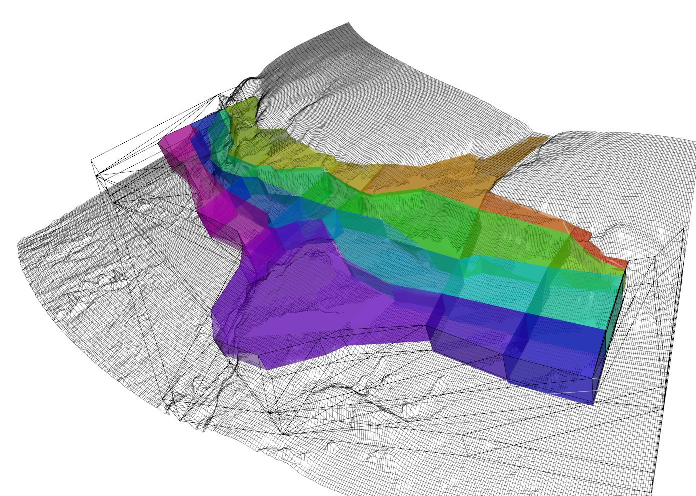

```{r setup, include=FALSE}
knitr::opts_chunk$set(echo = TRUE)
library(rbgm)
```

## Abstract


Modern geospatial standards don't include *meshes*, the basic data structures of computer graphics and physical modelling.  This talk will illustrate the nice features of mesh structures, why they have been somewhat ignored, and how we can work with them along with our geospatial workflows. 

Meshes are inherently *indexed*, storing de-duplicated elements with pointers to shared parts. Primitive elements ( i.e. vertices, line segments, triangles, quads, tetrahedrons and others) are defined indirectly by index to the coordinates that define them. Shapes, and higher level groupings are stored by indexing the primitives they are composed of. Modern geospatial has mostly settled on the norm of inferring topology on-the-fly, and storing atomic records that are standalone - they don't require links to other parts of the data. However, when records are to be compared for relationships and whole or partial equality, they are decomposed to their essentials (primitives) and compared at a low level, with a summary shape sent back up to the surface. Our tools use tricks from mesh world to achieve these tasks, and we can benefit from using them more directly. 

Geospatial types are limited for some tasks, super efficient for planar tasks, but GPS, animal tracking, transport networks, point clouds, computer aided design, VR/AR and games do not inhabit the plane. 

- Shapes are not represented as topological primitives and so internal boundaries are precluded.
- Shapes are represented as paths so only planar polygonal shapes are possible.
- Shapes may exist in XY[Z[M]] geometry, but this is not extensible, with no capacity to store data against component geometry elements.
- Shapes have no persistent naming of features or their components.
- There is no capacity for internal topology of shapes or within collections (no vertex-, edge-, or path-sharing).

We will present some accessible tools in R for converting raster and vector data into mesh forms for visualization and integration with standard geospatial tools.

# Meshes

Wikipedia: 

> A mesh is a barrier made of connected strands of metal, fiber, or other flexible or ductile materials. A mesh is similar to a web or a net in that it has many attached or woven strands.


>
> See also: Polygon mesh
>





> 
> Wikipedia: Polygon
>

> In elementary geometry, a polygon is a plane figure that is bounded by a finite chain of straight line segments closing in a loop to form a closed polygonal chain or circuit. These segments are called its edges or sides, and the points where two edges meet are the polygon's vertices or corners. The interior of the polygon is sometimes called its body. An n-gon is a polygon with n sides; for example, a triangle is a 3-gon. A polygon is a 2-dimensional example of the more general polytope in any number of dimensions.


# Polygon layer for ecosystem modelling

Presented without comment. 

```{r}
library(rbgm)
model <- bgmfile(bgmfiles::bgmfiles("antarctica_28"))
plot(boxSpatial(model))

```

```{r atlantis-3d, include=FALSE}
f <- "images/atlantis-bgm-3d.png"
if (!file.exists(f)) {
  s <- "images/Cb-hOwBUUAA5TbH.jpg_large" 
  if (!file.exists(s)) {
    curl::curl_download("https://pbs.twimg.com/media/Cb-hOwBUUAA5TbH.jpg:large", s)
  }
  rgdal::writeGDAL(as(raster::aggregate(raster::brick("images/Cb-hOwBUUAA5TbH.jpg_large"), fact = 2, fun = function(x, na.rm = TRUE) x[1]), "SpatialGridDataFrame"), 
                 "images/atlantis-bgm-3d.png",
                 driver = "PNG")
}
```




mesh3d described in https://hypertidy.github.io/quadmesh/articles/quadmesh.html#why-quadmesh


Describe this indexing and then plot a raster with mesh_plot, lossless reprojection. 


Describe the very basics of minimal_mesh, composed of edges, and trivially that it has one shared edge only. Using SC we can classify very easily the neighbours of any feature. 


# Three viewpoints of a raster


* discrete cells, sequential edges
* discrete cells, quadrilateral edges
* centre points, triangle edges

3D view, the quad doesn't really make sense in continuous space


```{r }

# Three viewpoints of a polygon layer

* discrete cells, sequential edges
* discrete cells, n-coordinates clockwise path
* 
